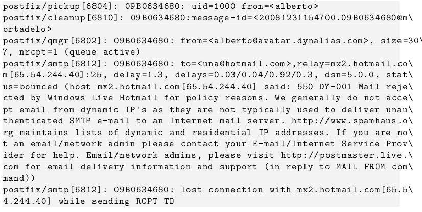

# Caso 3: Envío de correo desde usuarios del servidor a correos de internet

**DESDE EL AULA**

En el caso de la configuración de nuestra red del insitituto sólo puede enviar correo el servidor de correo de babuino. Por lo tanto tenemos que configurar nuestro servidor para que utilice a babuino como relay para enviar nuestros correos, para ello, modificamos la siguiente directiva en el fichero de configuración:

	ralayhost = babuino.gonzalonazareno.org

**DESDE CASA**

Con la configuración que tienes actualmente podrías mandar correos al exterior.

Si en tu casa tienes un dirección IP dinámica seguramente gmail /hotmail/yahoo lo rechaza, por estar en una lista de bloqueo, al intentar enviar un correo nos salen registro de este tipo:

Para solucionar este problema tenemos varias soluciones, que veremos en los siguientes apartados:

* Enviar correos a partir de un realy host autentificado
* Estudiar las listas de bloqueos
* Crear registros SPF
