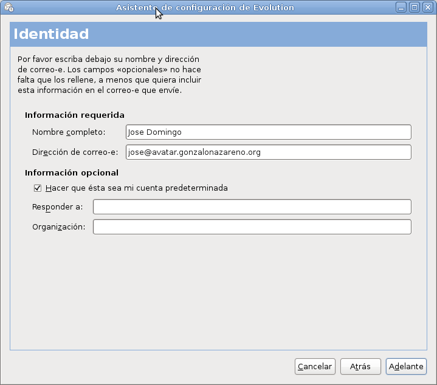
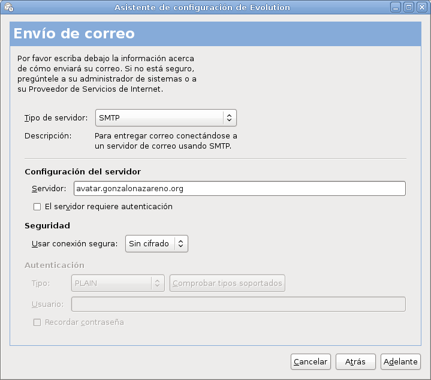
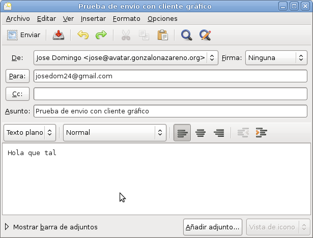

# Caso 4: Envio de correo electrónico usando nuestro servidor de correos

En este caso queremos que poder gestionar el envio y la recepción de corresos desde los ordenadores de neustra red local. Para ello debemos habilitar el envío de correo desde cliente de nuestra red. Para ello añade 192.168.1.0/24 (suponiendo que esta es nuestra red local) en la directiva mynetworks, quedando:

	mynetworks = 127.0.0.0/8 [::ffff:127.0.0.0]/104 [::z1] 192.168.1.0/24

Es el momento de utilizar un cliente de correos (evolution, outlook, icedove, Thunderbird,...) en los clientes de nuestra red local para el envío de correos electrónicos. Para ello es necesario indicarle el nombre de nuestro servidor de correos, en mi caso ``smtp.josedom.gonzalonazareno.org``, para ello desde los ordenadores de nuestra red local este nombre debe ser conocido, ya sea por resolución estática o usando un servidor DNS).

Veamos la configuración del cliente de correo Evolutión:

